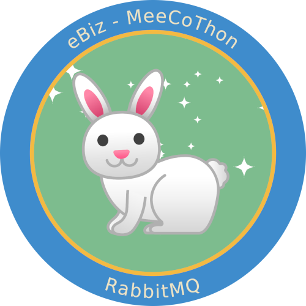

In this scenario we'll be having a getting started tutorial for Rabbitmq, and installing it in a kubernetes environment.

Beyond that we will set up an application, which will create an exchange and publish messages to that. This enables us to dive into different exchanges and their possible bindings.